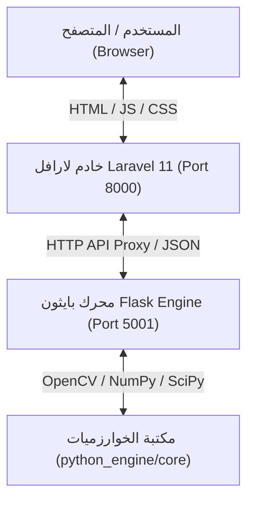

# وثيقة مواصفات متطلبات البرمجيات (SRS)
## مشروع VisionCraft - Digital Image Processing (DIP) Studio

---

**إعداد/مسؤول التقرير**: فريق هندسة البرمجيات (Software Engineering Team)  
**المشروع**: VisionCraft - منصة استوديو معالجة الصور الرقمية  
**الإصدار**: 2.0  
**التاريخ**: سبتمبر 2026  
**الحالة**: معتمدة للتطوير والاختبار (Approved for Development & Testing)  

---

## 1. المقدمة والنظرة العامة (Introduction & Overview)

### 1.1 الهدف من المستند (Document Purpose)
تهدف هذه الوثيقة إلى تقديم مواصفات تفصيلية وشاملة لمتطلبات البرمجيات (Software Requirements Specification - SRS) لمنصة **VisionCraft - Digital Image Processing Studio**. تُحدد الوثيقة المتطلبات الوظيفية وغير الوظيفية، المعمارية الهندسية، قيود التصميم، وسيناريوهات الاستخدام المستهدفة لتكون المرجع الأول لمصممي ومطوري ومختبري النظام.

### 1.2 نطاق النظام (System Scope)
نظام **VisionCraft** هو بيئة ويب تفاعلية متكاملة لمعالجة الصور الرقمية، تم تصميمها لخدمة الطلاب والمهندسين والباحثين في مجالات هندسة البرمجيات ورؤية الحاسوب (Computer Vision). يوفر النظام واجهة رسومية غنية شبيهة ببرامج التحرير الاحترافية (مثل Photoshop)، مدعومة بمحرك خوارزميات بايثون يعمل كخدمة مصغرة (Microservice) منفصلة لتنفيذ المعالجة الرياضية المعقدة بمرونة وكفاءة عالية.

### 1.3 المصطلحات والتعريفات (Definitions & Acronyms)
| المصطلح | التعريف / المعنى |
| :--- | :--- |
| **DIP** | معالجة الصور الرقمية (Digital Image Processing) |
| **SRS** | وثيقة متطلبات البرمجيات (Software Requirements Specification) |
| **API Proxy** | خادم لارافل الوسيط الذي يتلقى طلبات الواجهة ويغلفها لخدمة بايثون |
| **Microservice** | نمط المعمارية البرمجية القائم على تقسيم النظام لخدمات مستقلة |
| **Custom Kernel** | مصفوفة نواة مخصصة يُدخلها المستخدم لتطبيق مرشحات مكانية فريدة |
| **FFT** | تحويل فورير السريع (Fast Fourier Transform) للتحويل للمجال الترددي |

### 1.4 المراجع (References)
- مواصفات معايير IEEE 830-1998 لكتابة متطلبات البرمجيات.
- دليل خوارزميات معالجة الصور الرقمية - كتاب *Digital Image Processing (Gonzalez & Woods)*.
- التوثيق الرسمي لإطار العمل **Laravel 11** ومكتبات **OpenCV**, **NumPy**, **SciPy**, **Flask**.

---

## 2. الوصف العام للنظام (Overall Description)

### 2.1 معمارية النظام (Product Perspective)
يعتمد النظام معمارية الخدمات المصغرة المزدوجة (Dual Microservices Architecture):
1. **الواجهة الأمامية والوسيط (Frontend & API Gateway)**:
   - مبنية باستخدام **Laravel 11** و **Blade Templates** بالإضافة لـ JavaScript / Vanilla CSS.
   - تتولى إدارة جلسات المستخدم، توفير واجهة التحرير التفاعلية، وتمرير الطلبات بـ HTTP Proxy إلى محرك المعالجة.
2. **محرك المعالجة الرقمية (Python Processing Engine)**:
   - بيئة مستقلة تُدار عبر **Flask** على المنفذ `5001`.
   - تعتمد على مكتبات **OpenCV**, **NumPy**, و **SciPy** لتنفيذ الخوارزميات الحسابية وإرجاع النتائج المعالجة كبيانات Base64 أو روابط ثنائية.

### 2.2 وظائف المنتج الرئيسية (Product Functions)
- **رفع وإدارة الصور والطبقات**: إمكانية رفع صور بأحجام وصيغ متعددة (PNG, JPEG, WEBP) وإدارتها كطبقات (Layers).
- **العمليات النقطية (Point Operations)**: التحكم بالسطوع، التباين، العتبة (Thresholding)، السلبي (Negative)، وموازنة المدرج التكراري (Histogram Equalization).
- **التحويلات اللونية (Color Space Conversions)**: التحويل بين RGB, HSV, LAB, Grayscale, Binary.
- **الفلاتر والمرشحات المكانية (Spatial Filters)**: التنعيم (Blur, Gaussian, Median) والمرشحات المخصصة (Custom Convolution Kernels).
- **كشف الحواف (Edge Detection)**: خوارزميات Sobel, Prewitt, Canny, Laplacian.
- **المجال الترددي (Frequency Domain)**: تحويل فورير السريع (FFT)، الفلاتر الترددية Low-pass / High-pass.
- **العمليات المورفولوجية (Morphological Operations)**: الاتساع (Dilation)، التآكل (Erosion)، الفتح (Opening)، الإغلاق (Closing).
- **العمليات الهندسيّة ودمج الطبقات (Geometric Operations & Composition)**: الدوران، التكبير/التصغير، القص، ودمج الطبقات بنماذج مزج متعددة (Blend Modes).

### 2.3 فئات المستخدمين وخصائصهم (User Classes & Characteristics)
1. **الطلاب والباحثون الأكاديميون**: يهدفون إلى فهم آلية عمل الخوارزميات وتجربة التأثيرات الرياضية والمصفوفات المخصصة بشكل مرئي ومباشر.
2. **المطورون ومهندسو البرمجيات**: يستخدمون المنصة لتجربة الخدمات المصغرة واختبار خوارزميات التحرير عبر API.
3. **المستخدمون العاديون المصممون**: يطمحون لأداة سريعة في المتصفح لتعديل الصور وتطبيق المؤثرات والقص وإزالة الخلفية.

### 2.4 بيئة التشغيل والقيود التقنية (Operating Environment & Constraints)
- **بيئة الخادم (Server Environment)**:
  - PHP >= 8.2 مع حزمة Composer.
  - Python >= 3.10 مع مثبت الحزم `pip`.
  - Node.js لتجميع الأصول إن لزم.
- **بيئة العميل (Client Browser)**:
  - متصفح حديث يطابق معايير HTML5/ES6 (Chrome, Edge, Firefox, Safari).
- **قيود الأداء والحجم**:
  - الحجم الأقصى للصورة المرفوعة: **50 ميجابايت** لتفادي استهلاك الذاكرة العشوائية (Out Of Memory).
  - الحد الأقصى لأبعاد الصورة: 4096 × 4096 بكسل للعرض السلس في المتصفح.

---

## 3. المتطلبات الوظيفية المفصلة (Detailed Functional Requirements)

### 3.1 إدارة الصور ومساحة العمل (Image & Workspace Management)
- **FR-01 (رفع الصور)**: يجب أن يتيح النظام للمستخدم رفع صورة واحدة أو أكثر من جهازه المحلي بصيغ `PNG`, `JPG`, `JPEG`, `WEBP`.
- **FR-02 (معاينة الصورة)**: يجب عرض الصورة المرفوعة فوراً في منطقة مساحة العمل الرئيسية (Canvas) مع إمكانية التكبير والتصغير (Zoom In / Out).
- **FR-03 (التراجع والإعادة Undo/Redo)**: يجب أن يحتفظ النظام بسجل الحالات (History Stack) ليتيح للمستخدم التراجع عن التعديلات حتى 10 خطوة سابقة على الأقل.

### 3.2 معالجة العمليات النقطية والألوان (Point & Color Processing)
- **FR-04 (السطوع والتباين)**: يجب توفير منزلقات تفاعلية (Sliders) لتغيير درجة السطوع (Brightness) والتباين (Contrast) بلحظية.
- **FR-05 (موازنة المدرج التكراري)**: يجب تقديم خيار لتطبيق خوارزمية Histogram Equalization لتحسين توزيع التباين التلقائي.
- **FR-06 (الفضاءات اللونية)**: يجب أن يتيح النظام تحويل فضاء ألوان الصورة من RGB إلى Grayscale, HSV, LAB, و Binary Thresholding مع تحديد قيمة العتبة.

### 3.3 المرشحات المكانية والكشف عن الحواف (Spatial Filtering & Edge Detection)
- **FR-07 (الفلاتر الجاهزة)**: يجب دعم المرشحات التالية: Box Blur, Gaussian Blur, Median Filter, Sharpening.
- **FR-08 (مصفوفة النواة المخصصة Custom Kernel)**: يجب السماح للمستخدم بإدخال مصفوفة أرقام (مثلاً 3x3 أو 5x5) وتطبيق عملية التفاف (Convolution) مباشرة.
- **FR-09 (كشف الحواف)**: يجب توفير خوارزميات كشف الحواف الأساسية: Sobel (X, Y, Magnitude), Prewitt, Canny Edge Detector مع التحكم بحدود التمييز (Thresholds).

### 3.4 معالجة المجال الترددي والمورفولوجيا (Frequency & Morphology)
- **FR-10 (تحويل فورير FFT)**: يجب أن يوفر المحرك خيار تحويل الصورة إلى طيف التردد (Magnitude Spectrum) وتمرير مرشحات العبور الترددي (Ideal / Butterworth Low-pass & High-pass).
- **FR-11 (العمليات المورفولوجية)**: دعم عمليات الديلاتيشن (Dilation)، الإيروجين (Erosion)، الفتح المورفولوجي، والإغلاق باستخدام عنصر هيكلي (Structuring Element) قابل للتحديد.

### 3.5 الطبقات والدمج والتصدير (Layers, Composition & Export)
- **FR-12 (إدارة الطبقات)**: إضافة طبقات جديدة، تغيير ترتيب الطبقات، التحكم بالشفافية (Opacity).
- **FR-13 (دمج الصور Blend Modes)**: توفير أنماط دمج متعددة (Normal, Multiply, Screen, Overlay, Add).
- **FR-14 (التصدير)**: إمكانية تنزيل الصورة النهائية بصيغ مختلفة (PNG / JPEG) وبجودة قابلة للتحديد.

---

## 4. المتطلبات غير الوظيفية (Non-Functional Requirements)

### 4.1 الأداء واستجابة النظام (Performance & Speed)
- **NFR-01 (زمن الاستجابة)**: يجب ألا يتجاوز زمن معالجة العمليات النقطية والمكانية الأساسية **2 ثانية** للصورة بحجم 1920×1080.
- **NFR-02 (زمن الاستجابة الترددية)**: يجب ألا يتجاوز زمن تحويل فورير والعمليات الترددية المعقدة **4 ثوانٍ**.
- **NFR-03 (استهلاك الذاكرة)**: يجب ألا تتجاوز الذاكرة المستهلكة في محرك بايثون **512 ميجابايت** لكل طلب معالجة فردي.

### 4.2 سهولة الاستخدام وتصميم الواجهة (Usability & Design)
- **NFR-04 (جماليات الواجهة)**: يجب أن تتمتع الواجهة بتصميم احترافي (Dark Theme / Glassmorphism) مريح للعين أثناء جلسات العمل الطويلة.
- **NFR-05 (التجاوب والوضوح)**: يجب أن تكون عناصر الواجهة واضحة ومتجاوبة مع مختلف مقاسات الشاشات (Desktop & Laptop).
- **NFR-06 (سهولة الوصول)**: ألا يتطلب استخدام الخيارات المعقدة أكثر من 3 ضغطات للوصول للنتيجة.

### 4.3 الأمان والموثوقية (Security & Reliability)
- **NFR-07 (التحقق من الملفات)**: يجب فحص الملفات المرفوعة في سيرفر لارافل لمنع رفع أي ملفات خبيثة وتحديد الامتدادات المسموحة فقط.
- **NFR-08 (معالجة الأخطاء)**: في حال حدوث خطأ في محرك بايثون، يجب إرجاع رسالة خطأ واضحة ومفهومة للمستخدم باللغة العربية دون توقف سيرفر لارافل.
- **NFR-09 (الموثوقية)**: يجب أن يحافظ النظام على نسبة جاهزية (Uptime) تبلغ 99.5% أثناء التشغيل المحلي أو الموزع.

---

## 5. مصفوفة تتبع المتطلبات ومعايير القبول (Requirements Traceability & Acceptance)

| رمز المتطلب | الوصف المختصر | مكون النظام المسؤول | مصفوفة التحقق والاختبار |
| :--- | :--- | :--- | :--- |
| **FR-01** | رفع الصور والتأكد من الصيغة | Laravel Controller | اختبار اختيار ملف PNG/JPG وملاحظة رفعه بنجاح |
| **FR-04** | ضبط السطوع والتباين | Python `point_ops.py` | اختيار السطوع +50 وملاحظة إضاءة الصورة فورياً |
| **FR-07** | تطبيق فلاتر التنعيم Blur | Python `spatial_filters.py` | تطبيق Gaussian Blur والتأكد من تنعيم البكسلات |
| **FR-08** | مصفوفة النواة المخصصة | Python `spatial_filters.py` | إدخال مصفوفة 3x3 واختبار الـ Convolution |
| **FR-09** | كشف الحواف باستخدام Canny | Python `edge_detectors.py` | التأكد من توليد صورة ثنائية تظهر الحدود |
| **FR-10** | تحويل فورير FFT | Python `frequency_ops.py` | اختبار إرجاع طيف التردد Magnitude Spectrum |
| **NFR-01** | زمن التنفيذ أقل من 2 ثانية | Laravel / Flask API | قياس الزمن المستغرق عبر شبكة المتصفح (Network tab) |

---

## 6. الخاتمة واقتراحات التطوير المستقبلي (Conclusion & Future Roadmap)
تُغطي هذه الوثيقة النواة الأساسية لمشروع **VisionCraft**، حيث تجمع بين قوة معمارية الخدمات المصغرة في Laravel وسرعة وخوارزميات المعالجة في Python. يمكن التوسع مستقبلاً في:
1. إضافة خوارزميات التعلم العميق (Deep Learning) لإزالة الخلفيات تلقائياً بـ AI.
2. دعم التحرير المباشر لمتجهات الفيديو (Video Stream Processing).
3. دعم التخزين السحابي وحسابات المستخدمين المتعددين.
